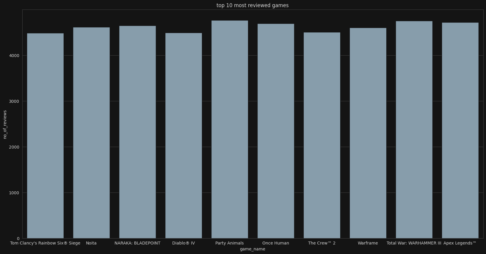
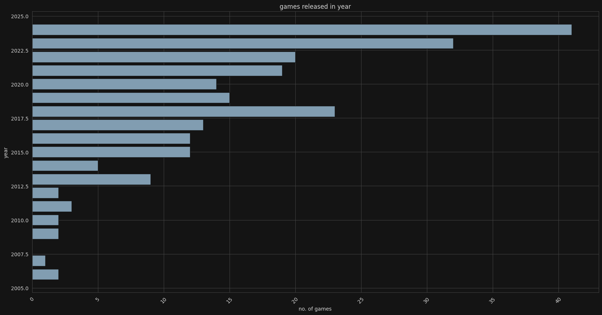
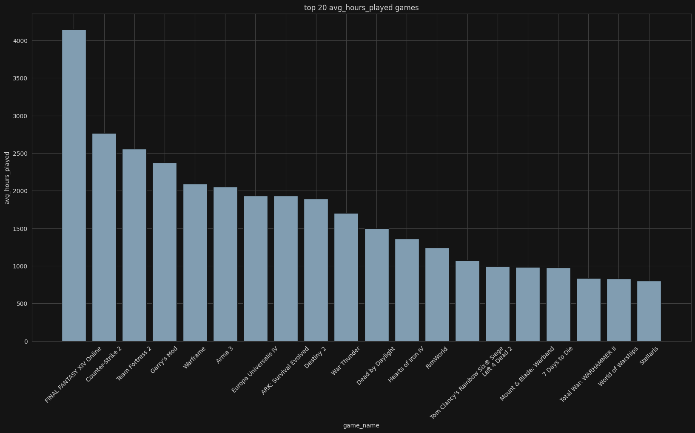
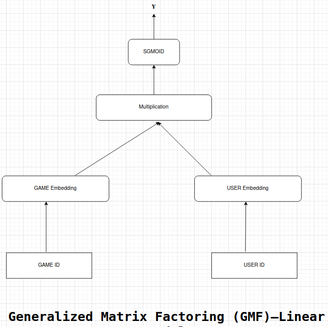
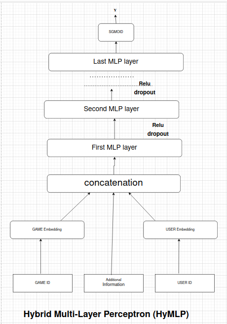
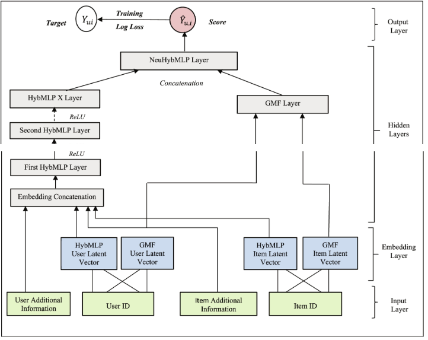

# Project Title: Steam Games Recommendation System With Deep Learning

# Overview
 In an era where player engagement is critical to the success of online games, our company seeks to enhance user experience through personalized recommendations. Currently, our recommendation system relies on basic algorithms that do not effectively capture user preferences and behaviors, leading to suboptimal game suggestions. To improve player retention and increase monetization opportunities, we aim to develop a Neural Collaborative Filtering approach model powered by deep learning.
# Problem Statement
The existing recommendation system struggles to provide relevant game suggestions tailored to individual users, resulting in low engagement rates and reduced player satisfaction. The limitations of traditional approaches hinder our ability to leverage vast amounts of user interaction data, including gameplay patterns, in-game purchases, and social interactions.
# Dataset
I used the [Steam Games and Reviews dataset](https://www.kaggle.com/datasets/mohamedtarek01234/steam-games-reviews-and-rankings), which includes:

- **Two datasets**: `game_description.csv` and `steam_game_reviews.csv`
- **Features**: Over 20 attributes such as `game_name`, `user_name`, `houred_play`, and `more`.
- **Target Variable**:  Game recommend by user.

```bash
# to pull repository
git clone https://github.com/spynom/game_recommendation_project.git

```

# Approach
## 1. **Data Preprocessing**: 
- fix data type of attributes
- cleaned messy in attributes such that numbers were represented in a comma-separated number.
- Handled missing values in descriptive attribute by filling from steam platform.
```bash
# to run data cleaning
python ./src/data_cleaning.py

# If you are on the windnow
python src\data_cleaning.py

```

## 2. **Data Exploration**: 
- Conducted exploratory data analysis (EDA) to understand the dataset and visualize relationships between features and the target variable.
<br>




## 3. **Data Preprocessing**: 
- performed feature encoding
- and scaled the data to prepare it for modeling 
- save encoded inputs  and target as npy format file for each target class to handel imbalance later.
- trained feature engineering model get saved inside models folder 
```bash
# run this command to apply feature engineering, then it will generate a memmap and npy files for train, validation and test
mkdir models # create models folder to save feature engineering model
python ./src/feature_engineering.py
# warning: files would be big, so recommended don't add to git tracking
```
## 3. **Model Selection**:
### GMF: 
- The Generalized Matrix Factorization (GMF) model is a popular approach for collaborative filtering in recommendation systems. It extends traditional matrix factorization techniques by utilizing deep learning methods to capture complex interactions between users and items.
<br>

<br>
```python
# you can use this model in building any neural Collaborative Filtering based recommendation system

import torch
from torch import nn

# GMF architecture
class GMF(nn.Module):
    def __init__(self,items_size,users_size,embedding_dim):
        super(GMF, self).__init__()

        self.items_embedding = nn.Embedding(items_size,embedding_dim)  # defining items embedding layer

        self.users_embedding = nn.Embedding(users_size,embedding_dim)  # defining users embedding layer

    def forward(self,items,users):
        item_vector = self.items_embedding(items.reshape(-1,1)).squeeze(1) # item vector the output

        user_vector = self.users_embedding(users.reshape(-1,1)).squeeze(1) # user vector the output

        mul_vector=user_vector*item_vector # multiplying vectors element wise
        
        return torch.sigmoid(torch.sum(mul_vector,dim=1)) # applying sigmoid
```

```bash
# to train this architecture model on game dataset

python ./src/GMF_model_build_and_train.py

# it will save trained model's parameters stage in models folder
```
### Hybrid Multi-Layer Perceptron (HyMLP):
- The Hybrid Multi-Layer Perceptron (HyMLP) model is a powerful approach in recommendation systems that combines collaborative filtering with deep learning techniques. This model is designed to leverage both user-item interactions and item features to make personalized recommendations.
<br>

<br>
```python
# Architecture of HybMLP
import torch
from torch import nn
import torch.nn.functional as F

class HybMLP(nn.Module):
    def __init__(self, num_items, num_users, items_embedding_dim, users_embedding_dim,
                 hidden_layers_size=(50, 50, 50, 50), dropout_prob=(0.25, 0.25, 0.25), output_size=1):
        super(HybMLP, self).__init__()

        # Define item and user embedding layers
        self.item_embedding = nn.Embedding(num_embeddings=num_items, embedding_dim=items_embedding_dim)
        self.user_embedding = nn.Embedding(num_embeddings=num_users, embedding_dim=users_embedding_dim)

        # Define hidden layers and corresponding dropout
        self.hidden_layer1 = nn.Linear(in_features=items_embedding_dim + users_embedding_dim + 358,
                                       out_features=hidden_layers_size[0])
        self.dropout1 = nn.Dropout(dropout_prob[0])

        self.hidden_layer2 = nn.Linear(in_features=hidden_layers_size[0], out_features=hidden_layers_size[1])
        self.dropout2 = nn.Dropout(dropout_prob[1])

        self.hidden_layer3 = nn.Linear(in_features=hidden_layers_size[1], out_features=hidden_layers_size[2])
        self.dropout3 = nn.Dropout(dropout_prob[2])

        self.hidden_layer4 = nn.Linear(in_features=hidden_layers_size[2], out_features=hidden_layers_size[3])
        self.dropout4 = nn.Dropout(dropout_prob[3])

        # Output layer
        self.output_layer = nn.Linear(in_features=hidden_layers_size[3], out_features=output_size)

    def forward(self, x1, x2, x3):
        # Apply embeddings
        item_vector = self.item_embedding(x1.reshape(-1, 1)).squeeze(1)
        user_vector = self.user_embedding(x2.reshape(-1, 1)).squeeze(1)

        # Concatenate item, user, and additional features
        concatenation = torch.cat((item_vector, user_vector, x3), dim=1)

        # Pass through hidden layers with dropout and ReLU activation
        first_hidden = self.hidden_layer1(concatenation)
        dropout_output1 = self.dropout1(first_hidden)
        relu1 = F.relu(dropout_output1)

        second_hidden = self.hidden_layer2(relu1)
        dropout_output2 = self.dropout2(second_hidden)
        relu2 = F.relu(dropout_output2)

        third_hidden = self.hidden_layer3(relu2)
        dropout_output3 = self.dropout3(third_hidden)
        relu3 = F.relu(dropout_output3)

        forth_hidden = self.hidden_layer4(relu3)
        dropout_output4 = self.dropout4(forth_hidden)
        relu4 = F.relu(dropout_output4)

        # Output layer
        output = self.output_layer(relu4)
        return torch.sigmoid(output)  # Sigmoid activation for binary classification
```
```bash
# to train this architecture model on game dataset

python ./src/HybMLP_model_building.py

# it will save trained model's parameters stage in models folder
```
### NHybf (Neural Hybrid Factorization):
- NHybf is a recommendation system model that combines neural networks with matrix factorization techniques to improve the effectiveness of collaborative filtering methods. This approach leverages the strengths of both deep learning and traditional factorization methods to enhance the accuracy of predictions in user-item interactions.
<br>

<br>
```python
# Architecture of NHybf
import torch
from torch import nn
import torch.nn.functional as F

class NHybF(nn.Module):
    def __init__(self, num_items, num_users, items_embedding_dim, users_embedding_dim, gmf_embedding_dim,
                 hidden_layers_size=(50, 50, 50, 50), dropout_prob=(0.25, 0.25, 0.25, 0.25), output_size=1):
        super(NHybF, self).__init__()

        # MLP architecture
        self.item_embedding = nn.Embedding(num_embeddings=num_items, embedding_dim=items_embedding_dim)
        self.user_embedding = nn.Embedding(num_embeddings=num_users, embedding_dim=users_embedding_dim)

        # Hidden layers with dropout
        self.hidden_layer1 = nn.Linear(in_features=items_embedding_dim + users_embedding_dim + 358,
                                       out_features=hidden_layers_size[0])
        self.dropout1 = nn.Dropout(dropout_prob[0])

        self.hidden_layer2 = nn.Linear(in_features=hidden_layers_size[0], out_features=hidden_layers_size[1])
        self.dropout2 = nn.Dropout(dropout_prob[1])

        self.hidden_layer3 = nn.Linear(in_features=hidden_layers_size[1], out_features=hidden_layers_size[2])
        self.dropout3 = nn.Dropout(dropout_prob[2])

        self.hidden_layer4 = nn.Linear(in_features=hidden_layers_size[2], out_features=hidden_layers_size[3])
        self.dropout4 = nn.Dropout(dropout_prob[3])

        # Output layer for MLP
        self.HybMLP_output_layer = nn.Linear(in_features=hidden_layers_size[3], out_features=output_size)

        # GMF architecture
        self.items_embedding1 = nn.Embedding(num_items, gmf_embedding_dim)
        self.users_embedding1 = nn.Embedding(num_users, gmf_embedding_dim)
        self.gmf_dropout = nn.Dropout(dropout_prob[4])

        # Final output layer combining MLP and GMF
        self.output_layer = nn.Linear(in_features=output_size + gmf_embedding_dim, out_features=1)

    def forward(self, x1, x2, x3):
        # MLP forward pass
        item_vector = self.item_embedding(x1.reshape(-1, 1)).squeeze(1)
        user_vector = self.user_embedding(x2.reshape(-1, 1)).squeeze(1)
        concatenation = torch.cat((item_vector, user_vector, x3), dim=1)

        relu1 = F.relu(self.dropout1(self.hidden_layer1(concatenation)))
        relu2 = F.relu(self.dropout2(self.hidden_layer2(relu1)))
        relu3 = F.relu(self.dropout3(self.hidden_layer3(relu2)))
        relu4 = F.relu(self.dropout4(self.hidden_layer4(relu3)))

        HybMLP_output = self.HybMLP_output_layer(relu4)

        # GMF forward pass
        GMF_item_vector = self.items_embedding1(x1)
        GMF_user_vector = self.users_embedding1(x2)
        GMF_mul_vector = GMF_item_vector * GMF_user_vector
        GMF_output = self.gmf_dropout(GMF_mul_vector)

        # Final concatenation and output
        concatenation = torch.cat((HybMLP_output, GMF_output), dim=1)
        return torch.sigmoid(self.output_layer(concatenation))

```
```bash
# to train this architecture model on game dataset

python ./src/NHybF_model_train.py

# it will save trained model's parameters stage in models folder

```
### 4. **Model Evaluation**: Used metrics like `ROC Curve`, `Precision Score` and `Confuse Matrix` to evaluate model performance and selected best model.

**Results**<br>
The final selected `HybMLP` model achieved on test data:
- accuracy: 0.6432
-  precision: 0.94 (approx)
- recall: 0.94 (approx)
- F1 score: 73.74 (approx)

## Deployed App
Please!, click here to check out my model : [Steam Game Recommendation App](https://gamerecommendationapp-z6czighdujsd8q8kauvqcc.streamlit.app/) 

